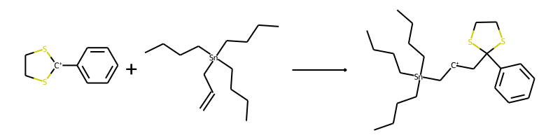

Automatically generate products from reactant SMILES.

# Usage

```
$ python3 generate_products.py [file.csv]
$ python3 generate_images.py [file_out.csv]
```

This generates a separate file with the suffix `[file]_out.csv` (any
sanitization errors encountered will be written to `[file]_err.csv`). To
generate images, run `generate_images.py` on this output file.

## Dependencies:

- Python 3.9.4
- RDKit 2021.03.1b1

# How the program works

## Generate transformations

`transforms.py` consists primarily of two dictionaries: one for nucleophiles
and one for electrophiles. Each nucleophile/electrophile is represented as a
SMARTS string, for both reactant and product:

```
nucleophiles = {
    "alkene": ["[C:1]=[CX3:2]", "[C+:1][CX3:2]"],
		...
}

electrophiles = {
    "C+": ["[CX3+:1]", "[C+0:1]"],
		...
}
```

Since all transformations involve only one nucleophile and electrophile, a
comprehensive set of all possible reaction SMARTS (limited to simple SN2-type
single bond formations) can be generated by iterating through both dictionaries
and performing simple string concatenation:

```
# electrophile atom indices are modified since
# no two atoms can share the same index

transformations = {
		"[C:1]=[CX3:2].[CX3+:11]>>[C+:1][CX3:2][C+0:11]",
		["alkene", "C+"],
		...
}
```

This allows a large collection of reaction SMARTS to be built up with little
manual work.

## Get products out of reactants

`smartjoin.py` accepts two reactants (represented as SMILES) and determines the
most likely product by:

1. iterating through the entire set of transformations,
1. attempting to find each substructure match,
1. applying the corresponding transformation, and
1. attempting to sanitize all possible products.

```
$ python3 smartjoin.py 'C1CS[C+](S1)C1=CC=CC=C1.CCCC[Sn](CCCC)(CCCC)CC=C

1 matching transformations found
1: ['alkene', 'C+'], 1 products
Up to 2 good products found
C1CS[C+](S1)C1=CC=CC=C1.CCCC[Sn](CCCC)(CCCC)CC=C>>CCCC[Sn](C[CH+]CC1(C2=CC=CC=C2)SCCS1)(CCCC)CCCC
['alkene', 'C+']
```

Sanitized products obtained from complex transformations typically take
precedence over those obtained from less complex ones, and the first product
obtained is assumed to be the correct one. Unsanitized products are usually a
sign of an incorrectly devised SMARTS string, which should be fixed.

This iteration process can be fairly CPU-intensive and is *far* from optimised,
but it seems to work well enough for a relatively small number of
nucleophiles/electrophiles (currently less than 30 each).

**Important note**: false substructure matches may be obtained; these will be
fixed in due time!

## Iterate through csv file, generate images

`generate_products.py` simply parses a csv file and passes every reactant
SMILES string that it finds to `smartjoin.py`. The results are written to a new
csv file, which can then be passed to `generate_images.py` to generate images
for all reactions.

As an example, the resulting image of the above reaction should look like this:



# Limitations (what the program doesn't do... yet)

- Any transformations more complex than a simple single bond formation
- Automatic creation of new SMARTS (nucleophiles and electrophiles have to be manually added)
- Reactions with more than 2 reactants
- Reactions with more than 1 significant product

# TODO

- Concatenate output reaction SMILES to a copy of the input file
- Make SMARTS stricter to avoid false positive matches
- Programmatically detect false positive matches, and give some kind of warning
- `generate_images.py`: accept reactant SMILES as input
- `generate_products`: allow user to choose transformation (and show image afterwards)
- Create a comprehensive test suite (current test is based on an older approach)
